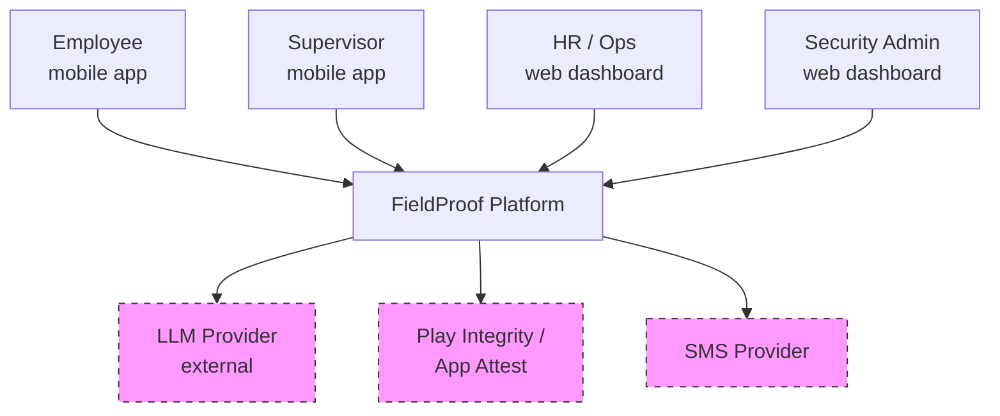
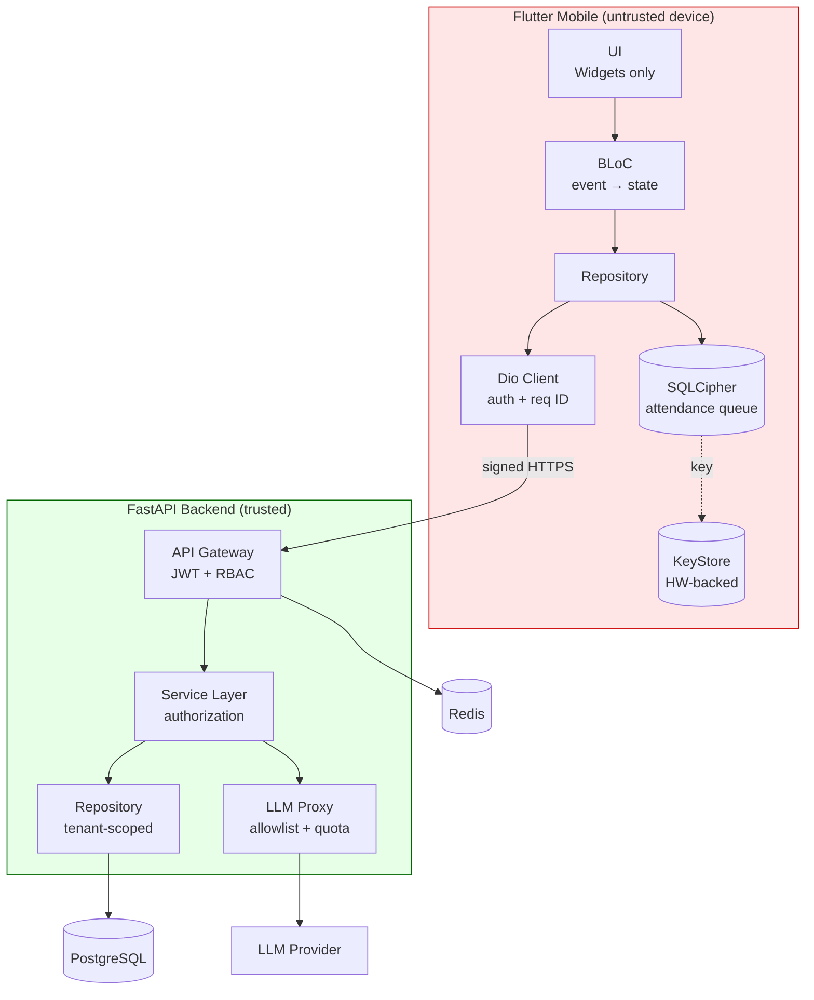
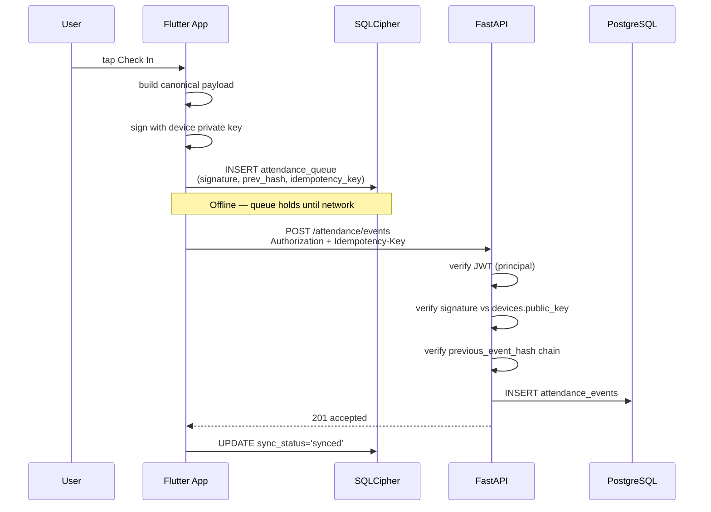
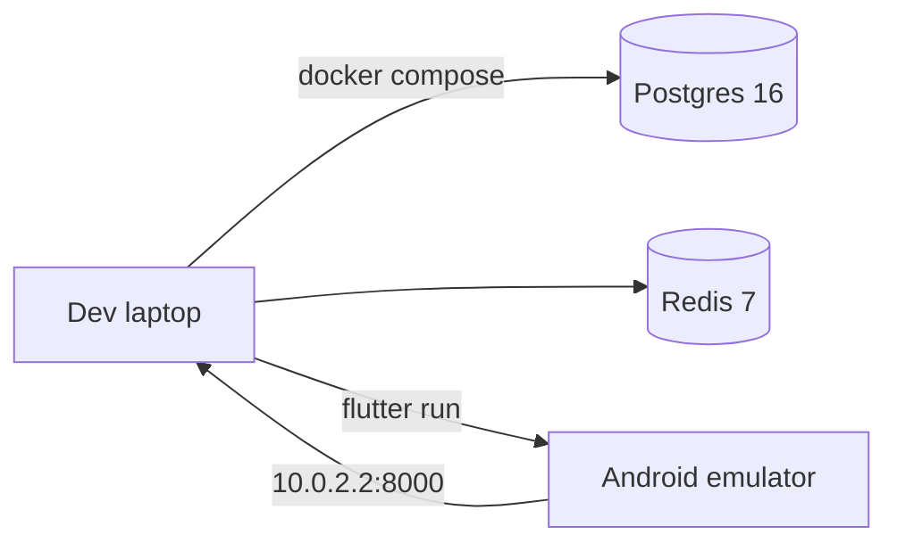

# FieldProof — Architecture (S0 Baseline)

- **Version:** 1.0
- **Date:** 2026-09-09
- **Sprint:** S0
- **Status:** Approved baseline

---
## 1. System context (C4 Level 1)

**Trust note:** every external boundary (LLM, Attest, SMS) is untrusted.
Data leaving FieldProof must be minimized and authorized.

---
## 2. Container diagram (C4 Level 2)

**Red = untrusted. Green = trusted.** The device is untrusted. The backend is trusted. Data crossing between them is validated server-side.

---
## 3. Attendance check-in flow (data flow, trust boundaries)

**Trust boundaries crossed:**
1. User → App (device untrusted)
2. App → API (network untrusted)
3. API → DB (trusted, parameterized)

**Rule:** every event is signed on-device and verified server-side. The local DB is a queue; the server is truth.

---
## 4. Trust boundary rules

| Boundary | Rule |
|----------|------|
| Device → API | Every request carries JWT. Server verifies principal. Never trust `user_id`/`tenant_id` from body. |
| App → Local DB | SQLCipher with HW-backed key. Every event signed. |
| API → LLM | Allowlist fields. No Restricted class. Backend proxy only. |
| API → DB | Parameterized queries. `tenant_id` from principal, never request. |

---

## 5. Data classification summary

See `docs/DATA_CLASSIFICATION.md`.

| Class | Where it lives | Crosses boundary? |
|-------|---------------|-------------------|
| P0 Public | Anywhere | Yes |
| P1 Internal | Backend, logs (P1-only) | Yes |
| P2 Confidential | Backend, encrypted at rest | Minimized |
| P3 Restricted | Backend proxy only, HW key | No client read path |
| Secret | Secure storage / secrets manager | Never |

---

## 6. Deployment topology (S0 local)

Production topology (AWS) defined in S15 (Terraform).

---

## 7. References

- ADR-0001 — state management
- ADR-0002 — local database
- `docs/security/threat_register.md`
- `docs/DATA_CLASSIFICATION.md`